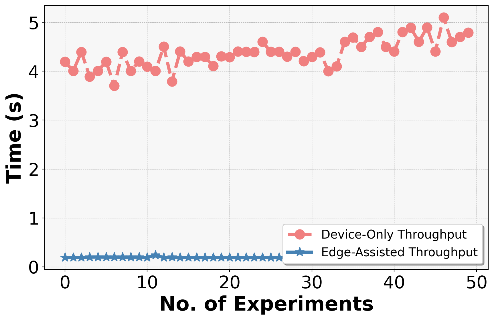

# SIMLESS: Post-Quantum EAP-TLS Architecture for Scalable IoT in Next-Generation Networks





## Steps to Run the Test

1. **Activate the environment**
   ```bash
   source venv/bin/activate
   ```

2. Git clone the `pqc_aes_multipath` repo:
```bash
https://github.com/abhisekjha/NextGenSecureMessaging.git
cd pqc_aes_multipath
```

3. git clone `Kyber based PYKY`
```bash
https://github.com/asdfjkl/pyky.git
```

4. git clone `Dilithium` and rename it to `dilithium`
```bash
https://github.com/GiacomoPope/dilithium-py
```


5. Set and verify Pythonpath:
``` sh
export PYTHONPATH=/path/to/NextGenSecureMessaging:/path/to/NextGenSecureMessaging/pyky:/path/to/NextGenSecureMessaging/dilithium
echo $PYTHONPATH
```

6. Install requirements.txt
```
pip install -r requirements.txt
```
7. Run test cases using make
```
make
```

## Acknowledgements

I would like to thank the [pyky](https://github.com/asdfjkl/pyky) repository and [dilithium-py](https://github.com/GiacomoPope/dilithium-py) for providing the implementation of the Kyber cryptographic algorithm and Dilithium Implementation, which was used in this project.
